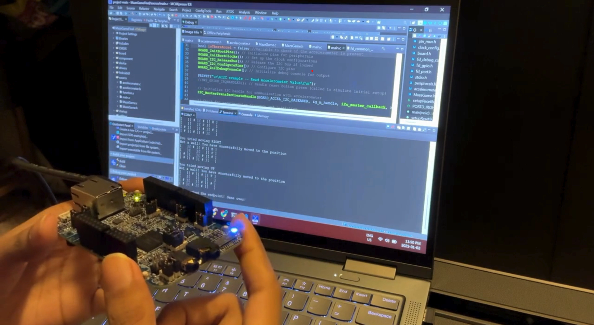

# Imaginary Maze Navigation Game

## Overview
The **Imaginary Maze Navigation Game** is an interactive embedded systems project designed to address the limitations of physical and software-based mazes. This project uses the NXP FRDM-K66F microcontroller to create a 4x4 invisible maze where players navigate using accelerometer data. The game emphasizes inclusivity and cognitive skill development through a unique, non-graphical approach. <br>


(See Video Demo Below)

## Problem Statement
Physical mazes are difficult to set up and lack flexibility, while software mazes rely heavily on visuals, limiting engagement and accessibility. This project aims to provide a digital solution that promotes inclusivity and cognitive skill development through an engaging virtual maze experience.

## Key Features
- **Invisible Maze Concept**: Navigate a 4x4 maze without a graphical interface.
- **Tilt-Based Navigation**: Use accelerometer data to navigate the maze by tilting the board.
- **LED Feedback**:
  - **Red LED**: Signals a wall encounter.
  - **Green LED**: Indicates a clear path.
  - **Blue LED**: Lights up upon reaching the maze endpoint.
- **Custom Reset Button**: Allows players to restart the game at any time.
- **Serial Communication (Development Phase)**: Displays the maze and provides real-time feedback during development only.

## Set Up
### Hardware Requirements
- NXP FRDM-K66F Microcontroller
- USB Cable for power and serial communication
- Host Computer for development and debugging

### Software Requirements
- MCUXpresso IDE
- NXP SDK for FRDM-K66F

### Steps to Set Up the Project
1. Clone the repository.
```bash
git clone https://github.com/masuma131/Imaginary-Maze-Game
```
2. Install MCUXpresso IDE: Download and install MCUXpresso IDE.
  
3. Download the SDK:
- Visit the NXP SDK Builder.
- Select the FRDM-K66F board and generate a compatible SDK package.
- Import the SDK into MCUXpresso IDE.

4. Import the Project:
- Open MCUXpresso IDE.
- Navigate to File > Import > Existing Projects into Workspace.
- Browse to the cloned repository folder and select the project.

5. Connect the Hardware:
- Use a USB cable to connect the FRDM-K66F board to your computer.

6. Build and Flash:
- Build the project in MCUXpresso IDE.
- Flash the program to the board by clicking the debug/run button.

## Future Plans
The project has exciting prospects for enhancements, including:
- **Audio Feedback**: Provide auditory signals for collisions, movements, and success to improve accessibility for visually impaired players.
- **Vibration Feedback**: Integrate haptic feedback for users with both hearing and visual impairments.
- **Advanced Game Logic**: Offer different game modes and improve motion detection.
- **Random Maze Generation**: Use algorithms to dynamically generate mazes for unique gameplay experiences.
- **Multiplayer Mode**: Enable wireless communication for multiplayer functionality.

## How to Play
1. Power on the FRDM-K66F board.
2. Tilt the board to navigate through the invisible maze.
3. Use the LED feedback to guide your progress:
   - Red LED indicates walls.
   - Green LED indicates a clear path.
   - Blue LED lights up when you reach the endpoint.
4. Press the reset button to restart the game.
   
## Demo Video
Check out the gameplay and features in action by watching the demo video:
[Watch Demo](https://youtu.be/Y5yXIvSMFpk?si=vNWENwVswH105zBH)


## Project Status
The initial version of the Virtual Maze Navigation Game is complete, including core gameplay and LED feedback. Future updates will focus on accessibility features, advanced game logic, and multiplayer functionality.


## References
- NXP Semiconductors, "FRDM-K66F: Development Board for Kinetis K66, K65, and K64 MCUs," [Online]. Available: [NXP Website](https://www.nxp.com/design/development-boards/freedom-development-boards/mcu-development-boards/mcu-development-platform-for-kinetis-k66-k65-and-k64:FRDM-K66F). [Accessed: 02-Dec-2024].

## License
This project is licensed under the [MIT License](LICENSE).
